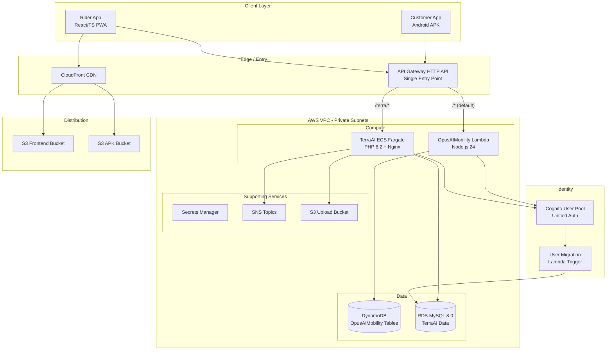
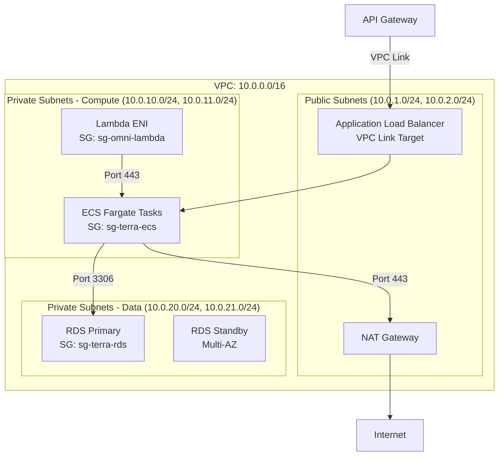
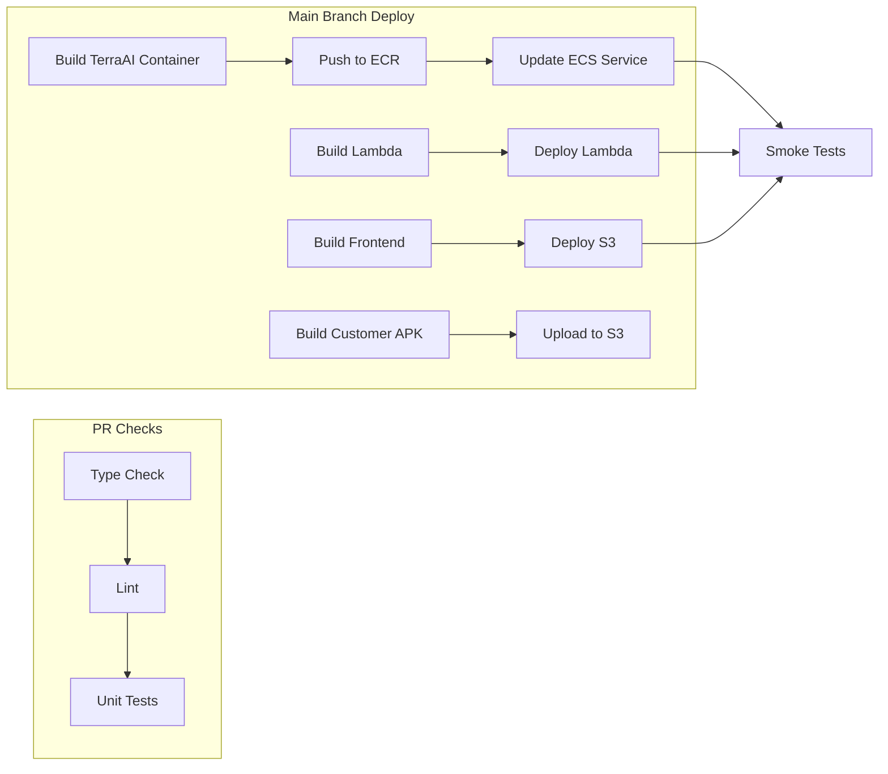

# Design Document: TerraAI–OpusAIMobility Consolidation

## Overview

This design describes the architecture for consolidating TerraAI's PHP API and MySQL database into the existing OpusAIMobility AWS platform. The result is a unified backend where both Node.js (OpusAIMobility) and PHP (TerraAI) services share a single VPC, a single API Gateway, a single Cognito user pool, and a unified CI/CD pipeline.

### Design Goals

- **Minimal disruption**: OpusAIMobility's existing Lambda + DynamoDB stack remains unchanged; TerraAI is added alongside it.
- **Single entry point**: One API Gateway routes to both backends based on path prefix.
- **Unified identity**: One Cognito user pool serves both Rider and Customer apps with seamless cross-app authentication.
- **Secure by default**: All backend services in private subnets, secrets in Secrets Manager, TLS everywhere.
- **Automated operations**: GitHub Actions CI/CD builds, tests, and deploys all components from one monorepo.

### Key Technical Decisions

| Decision | Choice | Rationale |
|----------|--------|-----------|
| PHP Runtime | **ECS Fargate** | TerraAI uses long-lived MySQL connections, session state, and file uploads. Fargate provides persistent containers with configurable memory/CPU, avoids Lambda cold-start and 15-min timeout limits for PHP. |
| Database | **RDS MySQL 8.0** (not Aurora Serverless) | TerraAI's schema uses MySQL-specific features (stored procedures, triggers). RDS MySQL provides compatibility and predictable pricing for a known workload. |
| API Routing | **API Gateway HTTP API** with path-based routing | Existing OpusAIMobility already uses this. Adding a VPC Link route for `/terra/*` is non-disruptive. |
| APK Distribution | **S3 + CloudFront** | Reuses existing CDN infrastructure. Lifecycle policies handle retention. |
| User Migration | **Cognito User Migration Lambda Trigger** | Lazy migration on first sign-in avoids bulk password reset while preserving user experience. |


## Architecture

### High-Level System Diagram




### Network Architecture



### Security Group Rules

| Security Group | Inbound | Source | Port |
|---------------|---------|--------|------|
| sg-terra-rds | Allow | sg-terra-ecs | 3306 |
| sg-terra-rds | Allow | sg-omni-lambda | 3306 |
| sg-terra-ecs | Allow | ALB SG | 80/443 |
| sg-terra-ecs | Allow | sg-omni-lambda | 443 |
| sg-omni-lambda | Allow | — (outbound only) | — |

| Security Group | Outbound | Destination | Port |
|---------------|----------|-------------|------|
| sg-terra-ecs | Allow | sg-terra-rds | 3306 |
| sg-terra-ecs | Allow | NAT Gateway | 443 |
| sg-omni-lambda | Allow | sg-terra-ecs | 443 |
| sg-omni-lambda | Allow | DynamoDB VPC Endpoint | 443 |


## Components and Interfaces

### 1. TerraAI PHP Service (ECS Fargate)

**Container Image**: PHP 8.2-FPM + Nginx sidecar (single task definition, two containers)

**Resource Allocation**:
- Memory: 1024 MB (512 MB PHP-FPM + 512 MB Nginx)
- vCPU: 0.5
- Min tasks: 0, Max tasks: 10
- Scale-out: CPU > 70% for 60s
- Scale-in: CPU < 40% for 60s

**Dockerfile** (new: `/infra/docker/terra-api/Dockerfile`):
```dockerfile
FROM php:8.2-fpm-alpine AS base
RUN docker-php-ext-install pdo_mysql mysqli
RUN apk add --no-cache nginx
COPY nginx.conf /etc/nginx/nginx.conf
COPY src/ /var/www/html/
EXPOSE 80
CMD ["sh", "-c", "php-fpm -D && nginx -g 'daemon off;'"]
```

**Health Check**: `GET /health` returns `{"status": "ok"}` (HTTP 200) when DB connection is alive.

**Environment Variables** (sourced from Secrets Manager at task startup):
- `DB_HOST` — RDS endpoint
- `DB_PORT` — 3306
- `DB_NAME` — terraai database name
- `DB_USER` — application user
- `DB_PASS` — from Secrets Manager
- `COGNITO_USER_POOL_ID` — shared pool ID
- `COGNITO_REGION` — us-east-1
- `S3_UPLOAD_BUCKET` — upload bucket name
- `SNS_TOPIC_ARN` — notification topic

### 2. API Gateway Routing

**Existing**: HTTP API with `$default` route → OpusAIMobility Lambda

**New Route**:
- Path: `ANY /terra/{proxy+}`
- Integration: VPC Link → ALB → ECS Fargate
- Timeout: 29 seconds
- Path rewrite: strip `/terra` prefix (using parameter mapping: `$request.path` → remove `/terra`)

**CORS Configuration** (applied at API Gateway level):
```json
{
  "AllowOrigins": ["*"],
  "AllowMethods": ["GET", "POST", "PUT", "PATCH", "DELETE", "OPTIONS"],
  "AllowHeaders": ["Content-Type", "Authorization"],
  "MaxAge": 86400
}
```


### 3. RDS MySQL Instance

**Engine**: MySQL 8.0.35
**Instance Class**: db.t3.medium (2 vCPU, 4 GB RAM) — upgradeable
**Multi-AZ**: Yes (standby in second AZ for failover)
**Storage**: 50 GB gp3, auto-scaling up to 200 GB
**Backup**: Automated daily, 7-day retention
**Encryption**: AES-256 (AWS-managed KMS key)
**Parameter Group**: Custom — `character_set_server=utf8mb4`, `max_connections=200`
**Subnet Group**: Private data subnets (10.0.20.0/24, 10.0.21.0/24)

### 4. Cognito User Pool (Extended)

The existing `opusaimobility-users` pool is extended with:

**New Lambda Triggers**:
- **User Migration**: Invoked on sign-in when user not found locally. Validates credentials against TerraAI's password hashes in RDS, returns user attributes if valid.

**Updated Schema** (no changes needed — existing `custom:role` with max 50 chars already supports `rider`, `customer`, `vendor`, `business`, `admin`).

**App Clients**:
- Existing: `opusaimobility-rider-client` (Rider app)
- New: `opusaimobility-customer-client` (Customer app) — same user pool, separate client ID for analytics separation.

### 5. Migration Script (`/scripts/migrate/`)

A Node.js CLI tool that orchestrates:

1. **Pre-migration snapshot**: Creates RDS snapshot before any changes
2. **Schema export**: Runs `mysqldump` against source TerraAI DB
3. **Data import**: Streams SQL into target RDS instance
4. **Verification**: Compares row counts per table, checks FK integrity
5. **User migration**: Creates Cognito records for active TerraAI users
6. **File migration**: Copies upload directory to S3
7. **Report generation**: Outputs summary JSON with counts and failures

### 6. S3 APK Distribution

**Bucket**: `opusaimobility-apk-distribution`
**CloudFront**: Separate distribution (or path behavior on existing)
- Origin: S3 bucket
- Behavior: `/apks/*` → S3 origin
- Cache TTL: 300 seconds (5 minutes) for `latest.apk`
- Cache TTL: 31536000 seconds for versioned APKs
- Content-Type override: `application/vnd.android.package-archive`

**Lifecycle Policy**:
- Prefix: `/apks/customer/debug/`
- Rule: Keep only 10 most recent objects (via expiration after Nth version using S3 noncurrent version expiration)


### 7. CI/CD Pipeline Extension

**Workflow Structure** (extended `deploy.yml`):



**Path Filters**:
| Changed Path | Triggered Jobs |
|-------------|---------------|
| `/apps/customer/**` | Customer APK build + upload |
| `/aws/lambda/**` | Lambda deploy |
| `/infra/docker/terra-api/**` or `/apps/terra-api/**` | TerraAI container build + ECS deploy |
| `/src/**` or `/public/**` | Frontend build + S3 deploy |
| `/packages/**` or root configs | All component builds |

**New Secrets Required**:
- `ECR_REPOSITORY` — ECR repo URI for TerraAI container
- `ECS_CLUSTER` — ECS cluster name
- `ECS_SERVICE` — ECS service name
- `TERRA_HEALTH_URL` — TerraAI health check URL

### 8. Monitoring Stack

**CloudWatch Logs**:
- Log group: `/ecs/terraai-api` (30-day retention)
- Log format: JSON with fields `{requestId, path, method, statusCode, latencyMs, timestamp}`
- PHP application uses a structured logger (Monolog with JSON formatter)

**CloudWatch Metrics** (custom namespace: `OpusAIMobility/TerraAI`):
- `RequestCount` (per endpoint, 60s period)
- `ErrorCount` (5xx responses, per endpoint, 60s period)
- `P95Latency` (per endpoint, 60s period)

**Alarms**:
- `TerraAI-HighErrorRate`: 5xx rate > 5% within 5-min window (minimum 10 requests)
- `TerraAI-HighLatency`: P95 > 5000ms within 5-min window
- Action: Publish to `opusaimobility-ops-alerts` SNS topic

**X-Ray**: Enabled on API Gateway and ECS tasks. PHP SDK (`aws/aws-xray-sdk`) instruments outgoing MySQL and HTTP calls.

**GuardDuty**: Enabled for VPC flow logs, S3 data events, and IAM anomaly detection. EventBridge rule routes HIGH/CRITICAL findings to ops SNS topic.

**Dashboard** (`OpusAIMobility-Consolidated`):
- Widget 1: TerraAI request count + error count (stacked area)
- Widget 2: P95 latency (line chart)
- Widget 3: Active alarms (alarm status widget)
- Widget 4: X-Ray service map (embedded)
- Widget 5: RDS connections + CPU (line chart)


## Data Models

### TerraAI Database (RDS MySQL) — Migrated Schema

The existing TerraAI MySQL schema is migrated as-is. Key tables include:

```sql
-- Core user table (maps to Cognito via email)
CREATE TABLE users (
    id INT AUTO_INCREMENT PRIMARY KEY,
    email VARCHAR(255) UNIQUE NOT NULL,
    password_hash VARCHAR(255) NOT NULL,  -- bcrypt
    name VARCHAR(100) NOT NULL,
    phone VARCHAR(20),
    role ENUM('customer', 'rider', 'vendor', 'admin') DEFAULT 'customer',
    status ENUM('active', 'suspended', 'deleted') DEFAULT 'active',
    created_at TIMESTAMP DEFAULT CURRENT_TIMESTAMP,
    updated_at TIMESTAMP DEFAULT CURRENT_TIMESTAMP ON UPDATE CURRENT_TIMESTAMP,
    INDEX idx_email (email),
    INDEX idx_status (status)
);

-- Trip/ride records
CREATE TABLE trips (
    id INT AUTO_INCREMENT PRIMARY KEY,
    customer_id INT NOT NULL,
    rider_id INT,
    pickup_lat DECIMAL(10, 8),
    pickup_lng DECIMAL(11, 8),
    dropoff_lat DECIMAL(10, 8),
    dropoff_lng DECIMAL(11, 8),
    status ENUM('pending', 'accepted', 'in_progress', 'completed', 'cancelled'),
    fare DECIMAL(10, 2),
    created_at TIMESTAMP DEFAULT CURRENT_TIMESTAMP,
    FOREIGN KEY (customer_id) REFERENCES users(id),
    FOREIGN KEY (rider_id) REFERENCES users(id)
);

-- File uploads tracking
CREATE TABLE uploads (
    id INT AUTO_INCREMENT PRIMARY KEY,
    user_id INT NOT NULL,
    original_filename VARCHAR(255),
    s3_key VARCHAR(500),  -- populated after migration
    file_size_bytes BIGINT,
    mime_type VARCHAR(100),
    created_at TIMESTAMP DEFAULT CURRENT_TIMESTAMP,
    FOREIGN KEY (user_id) REFERENCES users(id)
);
```

### Cognito User Attributes

| Attribute | Type | Source |
|-----------|------|--------|
| `email` (username) | String | TerraAI `users.email` |
| `name` | String | TerraAI `users.name` |
| `phone_number` | String | TerraAI `users.phone` (E.164 format) |
| `custom:role` | String (max 50) | TerraAI `users.role` |
| `custom:permissions` | String (max 1000) | Default `[]` |

### Migration Report Schema

```json
{
  "migrationId": "string (UUID)",
  "startedAt": "ISO 8601 timestamp",
  "completedAt": "ISO 8601 timestamp",
  "database": {
    "tables": [
      {
        "name": "string",
        "sourceRowCount": "number",
        "destRowCount": "number",
        "discrepancy": "number"
      }
    ],
    "totalDiscrepancies": "number",
    "foreignKeyValid": "boolean",
    "orphanedRecords": "number"
  },
  "users": {
    "totalProcessed": "number",
    "created": "number",
    "merged": "number",
    "failed": [
      { "userId": "string", "reason": "string" }
    ]
  },
  "files": {
    "totalFiles": "number",
    "totalBytes": "number",
    "failed": [
      { "path": "string", "reason": "string" }
    ]
  },
  "snapshotId": "string (AWS snapshot ID)",
  "status": "success | partial | failed"
}
```


### Monorepo Directory Structure

```
opusaimobility/
├── apps/
│   ├── customer/          # TerraAI Customer App (Android)
│   │   ├── src/
│   │   ├── build.gradle
│   │   └── ...
│   └── terra-api/         # TerraAI PHP API source
│       ├── src/
│       ├── composer.json
│       └── ...
├── aws/
│   ├── lambda/            # Existing OpusAIMobility Lambda
│   └── ...
├── infra/
│   ├── docker/
│   │   └── terra-api/     # TerraAI Dockerfile + nginx.conf
│   └── ecs/
│       └── task-def.json  # ECS task definition
├── packages/              # Shared libraries
│   └── common/            # Shared utilities (auth helpers, constants)
├── scripts/
│   └── migrate/           # Migration tooling
│       ├── export-db.js
│       ├── import-db.js
│       ├── migrate-users.js
│       ├── migrate-files.js
│       └── verify.js
├── src/                   # Existing OpusAIMobility frontend
├── .github/workflows/
│   ├── deploy.yml         # Extended pipeline
│   └── ...
└── package.json           # Workspace root
```

## Correctness Properties

*A property is a characteristic or behavior that should hold true across all valid executions of a system — essentially, a formal statement about what the system should do. Properties serve as the bridge between human-readable specifications and machine-verifiable correctness guarantees.*

### Property 1: Row Count Comparison Accuracy

*For any* pair of source and destination row count maps (one entry per table), the comparison report function SHALL correctly identify whether counts match (zero discrepancy) or produce the exact list of tables with non-zero discrepancies.

**Validates: Requirements 1.2, 1.5**


### Property 2: Constraint Violation Detection and Halt

*For any* dataset containing at least one referential integrity violation or data type mismatch, the migration import logic SHALL detect the violation, halt processing, and produce a report identifying the affected table and record(s).

**Validates: Requirements 1.4**

### Property 3: Missing Environment Variable Detection

*For any* subset of required database environment variables (host, port, database name, username, password) where at least one is missing or empty, the TerraAI API startup logic SHALL refuse to start and log which variable is missing.

**Validates: Requirements 2.5**

### Property 4: API Gateway Path Routing — TerraAI Prefix Strip

*For any* HTTP request path starting with `/terra/`, the routing logic SHALL strip the `/terra` prefix and forward the remainder to the TerraAI service (e.g., `/terra/chat` → `/chat`).

**Validates: Requirements 4.1**

### Property 5: API Gateway Path Routing — Default to OpusAIMobility

*For any* HTTP request path NOT starting with `/terra/`, the routing logic SHALL forward the request to the OpusAIMobility Lambda with the original path preserved unchanged.

**Validates: Requirements 4.2**

### Property 6: CORS Headers Present on All Responses

*For any* HTTP request (any method, any path), the API Gateway response SHALL include `Access-Control-Allow-Origin: *`, `Access-Control-Allow-Methods: GET, POST, PUT, PATCH, DELETE, OPTIONS`, and `Access-Control-Allow-Headers: Content-Type, Authorization`. For OPTIONS requests specifically, the response SHALL be HTTP 200 with an empty body.

**Validates: Requirements 4.5, 4.7**


### Property 7: JWT Role-Based Access Control

*For any* valid Cognito JWT token and any TerraAI API endpoint with a defined permission requirement, access SHALL be granted if and only if the token's `custom:role` value has permission for that endpoint. Invalid/expired tokens SHALL receive HTTP 401; valid tokens with insufficient role SHALL receive HTTP 403.

**Validates: Requirements 7.4, 7.5, 7.7**

### Property 8: User Migration Attribute Mapping

*For any* active TerraAI user record (status not suspended or deleted), the migration logic SHALL produce a Cognito user record with: email as username, name as `name` attribute, phone as `phone_number` attribute (E.164 format), and role mapped to `custom:role`.

**Validates: Requirements 8.1**

### Property 9: Legacy Credential Validation Round-Trip

*For any* TerraAI user with a known password, the user migration Lambda trigger SHALL correctly validate the supplied password against the stored bcrypt hash and return the user's attributes to Cognito upon successful validation.

**Validates: Requirements 8.2**

### Property 10: Duplicate User Merge Preserves Existing Credentials

*For any* user whose email exists in both TerraAI and Cognito, the merge logic SHALL: preserve the existing Cognito password, append TerraAI's role to the role attribute, copy TerraAI-only attributes (phone, name) that are absent in Cognito, and log the merge event with both identifiers.

**Validates: Requirements 8.4**

### Property 11: Migration Summary Report Accuracy

*For any* set of migration outcomes (N created, M merged, K failed with specific IDs), the summary report SHALL list totals that equal N+M+K for total processed, and SHALL include all K failed identifiers with their failure reasons.

**Validates: Requirements 8.6**


### Property 12: File Migration Preserves Directory Structure

*For any* file in TerraAI's upload directory with a relative path, the S3 key assigned during migration SHALL preserve the original directory structure as a key prefix (e.g., `uploads/avatars/user1.jpg` → S3 key `uploads/avatars/user1.jpg`).

**Validates: Requirements 9.1**

### Property 13: File Upload Size Enforcement

*For any* file upload request, files with size ≤ 50 MB SHALL be stored in S3 successfully, and files with size > 50 MB SHALL be rejected with an HTTP 413 response without writing to S3.

**Validates: Requirements 9.2**

### Property 14: File Retrieval Returns URL or 404

*For any* file key requested from TerraAI API, if the key exists in S3 the response SHALL contain a pre-signed URL with expiration ≤ 1 hour; if the key does not exist, the response SHALL be HTTP 404.

**Validates: Requirements 9.3**

### Property 15: Device Token Limit Per User

*For any* user, the notification system SHALL store at most 10 device tokens. When an 11th token is registered, the oldest token SHALL be removed before adding the new one.

**Validates: Requirements 10.2**

### Property 16: Stale Device Token Cleanup

*For any* user with a device token that returns EndpointDisabled or InvalidParameter from SNS during a publish attempt, the system SHALL remove that token from the user's registered endpoints and emit a log entry with user ID, endpoint ARN, and removal timestamp.

**Validates: Requirements 10.4**

### Property 17: Device Token Rotation Without Duplicates

*For any* user re-registering a device token (same device, new token), the previous token for that device SHALL be replaced by the new token without creating a duplicate endpoint entry.

**Validates: Requirements 10.6**


### Property 18: CI Path Filter Correctness

*For any* set of changed file paths in a commit, the CI pipeline path filter logic SHALL trigger exactly the correct set of build jobs: changes in `/apps/customer/**` trigger only Customer APK build, changes in `/aws/lambda/**` trigger only Lambda deploy, and changes in shared paths (`/packages/**`, root configs) trigger all dependent builds.

**Validates: Requirements 11.4**

### Property 19: Structured Log Completeness

*For any* HTTP request processed by TerraAI API, the emitted log entry SHALL be valid JSON containing at minimum: `requestId` (non-empty string), `path` (request path), `statusCode` (integer), and `latencyMs` (non-negative number).

**Validates: Requirements 12.1**

## Error Handling

### Database Connectivity Failures

| Scenario | Response | Action |
|----------|----------|--------|
| RDS unreachable at startup | Refuse to start, log error | ECS marks task unhealthy after 3 failed health checks, replaces task |
| RDS unreachable during request | HTTP 503 `{"error": "Database connectivity failure"}` | No internal addresses or credentials exposed |
| Connection timeout (>5s) | HTTP 503 | Circuit breaker opens after 5 consecutive failures, closes after 30s |

### API Gateway Errors

| Scenario | Response | Action |
|----------|----------|--------|
| TerraAI service timeout (29s) | HTTP 504 `{"error": "Gateway timeout"}` | No retry by API Gateway |
| Route not found | HTTP 404 `{"error": "Path not found"}` | — |
| Lambda→TerraAI timeout (10s) | Lambda returns error to caller | Logged with X-Ray trace |

### File Upload Failures

| Scenario | Response | Action |
|----------|----------|--------|
| File > 50 MB | HTTP 413 `{"error": "File too large", "maxSize": "50MB"}` | Reject before upload |
| S3 upload network error | Retry up to 3× (exponential backoff: 1s, 2s, 4s) | If all fail: HTTP 502 |
| File not found on retrieval | HTTP 404 `{"error": "File not found"}` | — |

### Authentication Errors

| Scenario | Response | Action |
|----------|----------|--------|
| Missing Authorization header | HTTP 401 `{"error": "Authentication credentials required"}` | — |
| Malformed JWT | HTTP 401 `{"error": "Invalid token format"}` | — |
| Expired token | HTTP 401 `{"error": "Token expired"}` | Client should refresh |
| Valid token, insufficient role | HTTP 403 `{"error": "Insufficient permissions"}` | Audit log entry |

### Migration Failures

| Scenario | Action |
|----------|--------|
| Export interrupted | Discard partial file, log error, halt |
| Import constraint violation | Log affected records, halt import, produce error report |
| User migration individual failure | Skip user, log identifier + reason, continue |
| Snapshot creation failure | Halt migration entirely — do not proceed without backup |
| Rollback requested ≤72h | Restore from pre-migration snapshot |
| Rollback requested >72h | Use most recent daily backup, document data loss |

### Push Notification Failures

| Scenario | Action |
|----------|--------|
| SNS unreachable | Retry 3× with backoff (1s, 2s, 4s); if all fail → dead-letter queue |
| Endpoint disabled/invalid | Remove stale token, log removal event |
| Token rotation | Replace old token for device, no duplicate |


## Testing Strategy

### Unit Tests

Unit tests cover specific examples, edge cases, and isolated logic:

- **Migration script**: Test export file validation (empty file detection, corrupt SQL detection), row count comparison logic, error report generation
- **Auth middleware**: Test token parsing, signature validation with mock JWKs, role extraction, specific error responses for edge cases (empty string token, token with wrong issuer)
- **File upload handler**: Test size validation boundary (exactly 50 MB, 50 MB + 1 byte), S3 key generation, pre-signed URL generation
- **Routing logic**: Test path stripping for known paths, 404 for specific invalid paths
- **Notification handler**: Test payload structure validation, device token CRUD operations, DLQ routing on repeated failure

### Property-Based Tests

Property-based tests verify universal correctness across randomized inputs. Each test runs **minimum 100 iterations**.

**Library**: [fast-check](https://github.com/dubzzz/fast-check) (already aligned with project's TypeScript/Node.js ecosystem)

| Property | Test File | Tag |
|----------|-----------|-----|
| Property 1: Row Count Comparison | `tests/migration/row-count.property.test.ts` | `Feature: terraai-opusaimobility-consolidation, Property 1: Row count comparison accuracy` |
| Property 2: Constraint Violation Detection | `tests/migration/constraint-violation.property.test.ts` | `Feature: terraai-opusaimobility-consolidation, Property 2: Constraint violation detection` |
| Property 3: Missing Env Var Detection | `tests/terra-api/env-validation.property.test.ts` | `Feature: terraai-opusaimobility-consolidation, Property 3: Missing env var detection` |
| Property 4: Path Routing Terra Prefix | `tests/routing/terra-prefix.property.test.ts` | `Feature: terraai-opusaimobility-consolidation, Property 4: Terra prefix strip` |
| Property 5: Path Routing Default | `tests/routing/default-route.property.test.ts` | `Feature: terraai-opusaimobility-consolidation, Property 5: Default to OpusAIMobility` |
| Property 6: CORS Headers | `tests/routing/cors.property.test.ts` | `Feature: terraai-opusaimobility-consolidation, Property 6: CORS headers present` |
| Property 7: Role-Based Access | `tests/auth/rbac.property.test.ts` | `Feature: terraai-opusaimobility-consolidation, Property 7: JWT role-based access` |
| Property 8: User Migration Mapping | `tests/migration/user-mapping.property.test.ts` | `Feature: terraai-opusaimobility-consolidation, Property 8: User attribute mapping` |
| Property 9: Legacy Credential Validation | `tests/auth/legacy-credentials.property.test.ts` | `Feature: terraai-opusaimobility-consolidation, Property 9: Credential validation round-trip` |
| Property 10: Duplicate User Merge | `tests/migration/user-merge.property.test.ts` | `Feature: terraai-opusaimobility-consolidation, Property 10: Duplicate user merge` |
| Property 11: Migration Report Accuracy | `tests/migration/report.property.test.ts` | `Feature: terraai-opusaimobility-consolidation, Property 11: Report accuracy` |
| Property 12: File Path Preservation | `tests/migration/file-path.property.test.ts` | `Feature: terraai-opusaimobility-consolidation, Property 12: File path preservation` |
| Property 13: File Size Enforcement | `tests/terra-api/file-upload.property.test.ts` | `Feature: terraai-opusaimobility-consolidation, Property 13: File size enforcement` |
| Property 14: File Retrieval URL/404 | `tests/terra-api/file-retrieval.property.test.ts` | `Feature: terraai-opusaimobility-consolidation, Property 14: File retrieval` |
| Property 15: Device Token Limit | `tests/notifications/token-limit.property.test.ts` | `Feature: terraai-opusaimobility-consolidation, Property 15: Device token limit` |
| Property 16: Stale Token Cleanup | `tests/notifications/stale-token.property.test.ts` | `Feature: terraai-opusaimobility-consolidation, Property 16: Stale token cleanup` |
| Property 17: Token Rotation | `tests/notifications/token-rotation.property.test.ts` | `Feature: terraai-opusaimobility-consolidation, Property 17: Token rotation` |
| Property 18: CI Path Filter | `tests/ci/path-filter.property.test.ts` | `Feature: terraai-opusaimobility-consolidation, Property 18: CI path filter` |
| Property 19: Structured Log | `tests/terra-api/structured-log.property.test.ts` | `Feature: terraai-opusaimobility-consolidation, Property 19: Structured log completeness` |

### Integration Tests

Integration tests verify end-to-end behavior with real (or localstack) AWS services:

- **Database migration**: Run against local MySQL container, verify schema + data import
- **Cognito auth flow**: Test sign-up → sign-in → token refresh → cross-app access
- **API Gateway routing**: Deploy to staging, verify `/terra/*` routes reach ECS and default routes reach Lambda
- **S3 file operations**: Upload, retrieve (pre-signed URL), verify lifecycle policy
- **SNS notifications**: Publish and verify delivery to test endpoint
- **Health check**: Verify ECS task health check passes after deployment

### Smoke Tests

Post-deployment smoke tests (run in CI after deploy):

- `GET /terra/health` → 200
- `GET /platform/settings` → 200
- `OPTIONS /terra/chat` → 200 with CORS headers
- APK download from CloudFront latest URL → 200 with correct content-type
